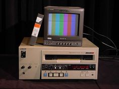

# react-redux-video-player

video player using react for components and redux for app state

## basics
- video player
- search bar: powers video list
- video list: updates on-the-fly
- search utilizes YouTube API

This project is intended to extend the video player created in [Stephen Grider's](https://github.com/StephenGrider) excellent course on Udemy, [Modern React with Redux](https://www.udemy.com/react-redux). If you aren't able to view the course, I recommend his companion code at [ReduxCasts](https://github.com/StephenGrider/ReduxCasts).